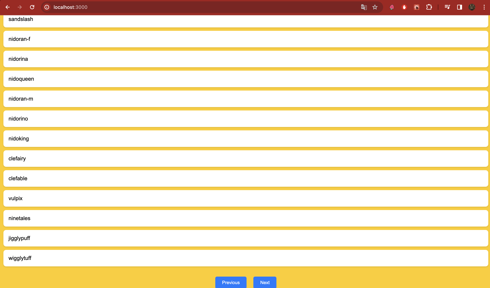

# Pokemon List React Practise

This project is a simple React application that displays a list of Pokemons. It fetches data from the [PokeAPI](https://pokeapi.co/).

## Overview

The application allows users to browse through a list of Pokemons. It features pagination, allowing users to navigate between different pages of Pokemon data.

## Key Features

- Lists Pokemons fetched from PokeAPI.
- Supports pagination to browse through the Pokemon list.
- Displays loading state when fetching data.

## Technologies Used

- React (Hooks: useState, useEffect)
- Axios for API requests
- PokeAPI for fetching Pokemon data

## Setup

To run this project, install it locally using npm:

npm install
npm start

## Tutorial Followed

This project was built following a tutorial by [Web Dev Simplified](https://www.youtube.com/watch?v=o3ZUc7zH8BE&list=PLZlA0Gpn_vH_NT5zPVp18nGe_W9LqBDQK&index=3&ab_channel=WebDevSimplified).

## Lessons Learnt

Throughout the development of this project, several valuable lessons were learnt:

- **Understanding React Hooks:** Gained a deeper understanding of useState and useEffect, and how they can be used to manage component state and side effects.
- **API Integration:** Learned the essentials of integrating and fetching data from a third-party API using Axios.
- **React Component Design:** Improved skills in designing functional components in React and understanding the importance of component reusability.

